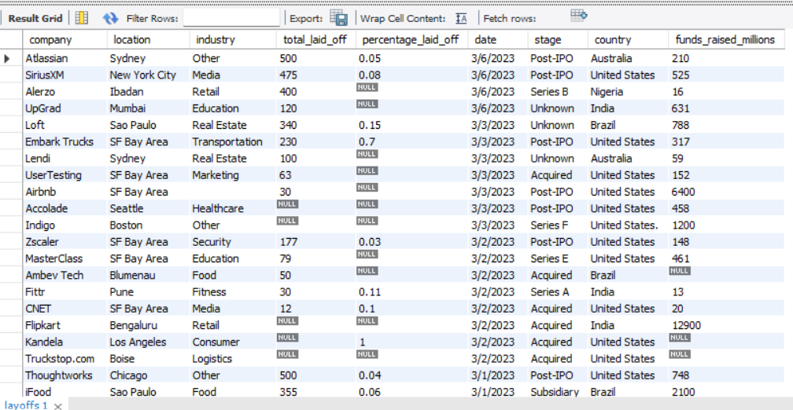
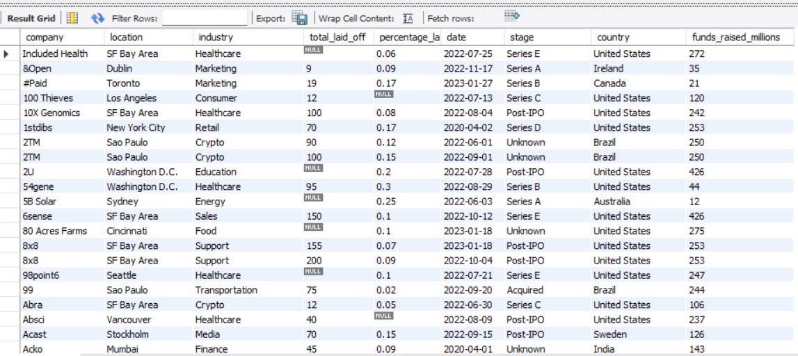

# 🧹 Layoffs 2022 — SQL Data Cleaning Project

Cleaning and standardizing a real-world, messy dataset using pure SQL — turning raw, inconsistent records into an analysis-ready table. 📊

---

## 📌 Overview

This project takes the [Layoffs 2022 dataset](https://www.kaggle.com/datasets/swaptr/layoffs-2022) from Kaggle — a raw export tracking company layoffs worldwide — and cleans it into a reliable, query-ready table using only SQL.

Real-world data is rarely clean. This dataset had duplicate records, inconsistent text formatting, encoding errors, mismatched date formats, and a mix of null and blank values. The goal was to fix all of that without losing any real data, using a systematic, repeatable process.

## 🔍 Before & after

**Raw data** — inconsistent nulls, unformatted dates, mixed formatting



**Cleaned data** — standardized, deduplicated, analysis-ready



## 📁 Dataset

- **Source:** [Kaggle — Layoffs 2022](https://www.kaggle.com/datasets/swaptr/layoffs-2022)
- **Contents:** Company name, location, industry, total employees laid off, percentage laid off, date, company stage, country, and funds raised

## 🛠️ Cleaning process

The cleaning followed four stages, each handled in its own script.

### 1️⃣ Remove duplicates
`remove_duplicates.sql`

- Copied raw data into a staging table to keep the original untouched
- Used `ROW_NUMBER()` with `PARTITION BY` across all relevant columns to flag exact duplicate rows
- Isolated true duplicates (`row_num > 1`) using a CTE
- Rebuilt the table with the row number as a real column (since you can't filter directly on a window function) and deleted the extras

### 2️⃣ Standardize the data
`standardizing_data.sql`

- Trimmed stray whitespace from company names
- Merged inconsistent category labels — e.g. multiple variants of "Crypto" collapsed into one standard value
- Fixed encoding issues in city names (e.g. corrupted characters in *Düsseldorf*, *Malmö*, *Florianópolis*)
- Standardized inconsistent country entries (e.g. `"United States."` → `"United States"`)
- Converted the `date` column from text to a proper `DATE` type using `STR_TO_DATE()`

### 3️⃣ Handle null and blank values
`handling_null_and_blank.sql`

- Removed rows where both `total_laid_off` and `percentage_laid_off` were null — these carried no usable information
- Converted blank strings in `industry` to proper `NULL` values for consistency
- Used a self-join on `company` to backfill missing `industry` values from other rows of the same company
- Dropped the helper `row_num` column once cleaning was complete

### 4️⃣ Final structure

The result is a clean, deduplicated, consistently formatted table ready for analysis or visualization in tools like Power BI, Tableau, or Python.

## 🧠 Key SQL techniques used

| Technique | Purpose |
|---|---|
| `ROW_NUMBER() OVER (PARTITION BY ...)` | Detect duplicate records |
| CTEs (`WITH ... AS`) | Isolate and inspect duplicates before deleting |
| `TRIM()` | Remove leading/trailing whitespace |
| `LIKE` + `UPDATE` | Standardize inconsistent category values |
| `REPLACE()` | Fix encoding/character errors in text fields |
| `STR_TO_DATE()` + `ALTER TABLE ... MODIFY` | Convert text dates into a proper `DATE` type |
| Self `JOIN` | Backfill missing values from matching records |
| `DELETE` / `ALTER TABLE ... DROP COLUMN` | Remove unusable rows and temporary helper columns |

## 📂 Files

```
├── remove_duplicates.sql        # Step 1: staging tables + duplicate removal
├── standardizing_data.sql       # Step 2: text, encoding, and date standardization
├── handling_null_and_blank.sql  # Step 3: null/blank handling + cleanup
└── README.md
```

## ▶️ How to use

1. Import the raw `layoffs` dataset into your MySQL instance
2. Run `remove_duplicates.sql` to create staging tables and remove duplicates
3. Run `standardizing_data.sql` to clean and standardize text/date fields
4. Run `handling_null_and_blank.sql` to resolve missing data and finalize the table

The end result, `layoffs_staging2`, is the cleaned dataset.

## 🧰 Tools

- **Database:** MySQL
- **Dataset source:** Kaggle

---

✨ *Part of my ongoing data analytics portfolio, alongside Excel, Power BI, and Python projects.*
